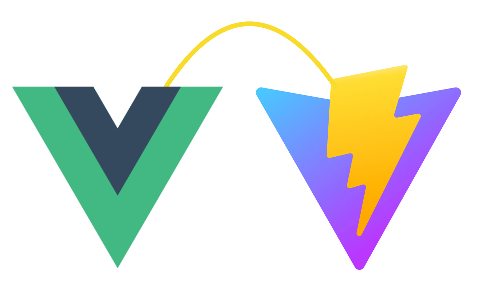

# Use Vite Today

> out-of-box for vue-cli projects without any codebase modifications.

<p align="center">
  
</p>

<p align="center">
  <!-- <a href="https://github.com/IndexXuan/vue-cli-plugin-vite/actions/workflows/npm-publish.yml"> -->
  <!--    -->
  <!-- </a> -->
  <a href="https://www.npmjs.com/package/vue-cli-plugin-vite" rel="nofollow" target="_blank">
    
  </a>
  <a href="https://www.npmjs.com/package/vue-cli-plugin-vite" rel="nofollow" target="_blank">
    
  </a>
  <a href="https://www.npmjs.com/package/vue-cli-plugin-vite" rel="nofollow" target="_blank">
    
  </a>
  <br />
  <a href="https://github.com/IndexXuan/vue-cli-plugin-vite/actions/workflows/ci.yml" target="_blank">
    
  </a>
  <!-- <a href="https://github.com/IndexXuan/vue-cli-plugin-vite#readme"> -->
  <!--    -->
  <!-- </a> -->
  <a href="https://github.com/IndexXuan/vue-cli-plugin-vite/graphs/commit-activity" target="_blank">
    
  </a>
  <a href="https://github.com/IndexXuan/vue-cli-plugin-vite/blob/main/LICENSE" target="_blank">
    
  </a>
  <!-- <a href="https://twitter.com/indexxuan" rel="nofollow"> -->
  <!--    -->
  <!-- </a> -->
</p>


## Table of Contents

<!-- toc -->

- [Usage](#usage)
- [Motivation](#motivation)
- [Options](#options)
- [Underlying principle](#underlying-principle)
  - [Compatibility](#compatibility)
  - [Differences between vue-cli and vite](#differences-between-vue-cli-and-vite)
- [Milestones](#milestones)
- [Examples](#examples)
- [Troubleshooting](#troubleshooting)
  - [Vite Build Support](#vite-build-support)
  - [How to completely migrate to vite in the future](#how-to-completely-migrate-to-vite-in-the-future)
  - [Some module response 404 not found](#some-module-response-404-not-found)
  - [Custom Style missing fonts](#custom-style-missing-fonts)
  - [JSX support](#jsx-support)
  - [Vue3 support](#vue3-support)
- [Benefits](#benefits)
  - [Best development-experience right now](#best-development-experience-right-now)
  - [Migration to vite smoothly](#migration-to-vite-smoothly)
  - [Lint the codebase](#lint-the-codebase)
  - [Use vue-cli ecosystem](#use-vue-cli-ecosystem)
- [Relevant Vite Plugins](#relevant-vite-plugins)

<!-- tocstop -->

## Usage
```sh
# 1. first step
vue add vite

# 2. second step
# NOTE you cannot directly use `vite` or `npx vite` since it is origin vite not this plugin.
yarn vite // or npm run vite
```
the plugin\'s generator will write some `main.html` for corresponding main.{js,ts}, since vite need html file for dev-server entry file


## Motivation
- We have lots of exists vue-cli(3.x / 4.x) projects.
- In Production: vue-cli based on webpack is still the best practice for bundling webapp(with code spliting, legecy-build for old browsers).
- In Development: instant server start and lightning fast HMR by vite is interesting.
- Why not use them together ?


## [Options](https://github.com/IndexXuan/vue-cli-plugin-vite/blob/main/config/options.ts)
```js
// vue.config.js
{
  // ...
  pluginOptions: {
    vite: {
      ///**
      // * deprecated since v0.2.2. we can auto-resolve alias from vue.config.js
      // * @ is setted by the plugin, you can set others used in your projects, like @components
      // * Record<string, string>
      // * @default {}
      // */
      // alias: {
      //   '@components': path.resolve(__dirname, './src/components'),
      // },
      /**
       * Plugin[]
       * @default []
       */
      plugins: [], // other vite plugins list, will be merge into this plugin\'s underlying vite.config.ts
      /**
       * you can enable jsx support by setting { jsx: true }
       * @see https://github.com/underfin/vite-plugin-vue2#options
       * @default {}
       */
      vitePluginVue2Options: {},
      /**
       * Vite UserConfig.optimizeDeps options
       * @default {}
       */
      optimizeDeps: {}
    }
  },
}
```


## Underlying principle

### Compatibility
- **NO EXTRA** files, code and dependencies injected
    - injected corresponding main.html
        - SPA: `projectRoot/main.html`
        - MPA: `projectRoot/src/pages/*/main.html`(s)
    - injected one devDependency `vue-cli-plugin-vite`
    - injected one line code in `package.json#scripts#vite` and one file at `bin/vite`
- auto-resolved as much options as we can from `vue.config.js` (publicPath, alias, outputDir...)
- compatible the differences between vue-cli and vite(environment variables, special syntax...)


### Differences between vue-cli and vite

| Dimension                        |         vue-cli     |     vite           |
|----------------------------------|---------------------|--------------------|
|     Plugin                       | 1. based on webpack. <br />2. have service and generator lifecycles. <br />3. hooks based on each webpack plugin hooks | 1. based on rollup. <br />2. no generator lifecycle. <br />3. universal hooks based on rollup plugin hooks and vite self designed |
|     Environment Variables        | 1. loaded on process.env. <br />2. prefixed by `VUE_APP_`. <br />3. client-side use `process.env.VUE_APP_XXX` by webpack definePlugin | 1. not loaded on process.env. <br />2. prefixed by `VITE_`. <br />3. client-side use `import.meta.env.VITE_XXX` by vite inner define plugin |
|     Entry Files                  | 1. main.{js,ts}.    | 1. *.html          |
|     Config File                  | 1. vue.config.js    | 1. vite.config.ts. <br />2. support use --config to locate |
|     MPA Support                  | 1. native support by `options.pages`. <br />2. with history rewrite support | 1. native support by `rollupOptions.input` |
|     Special Syntax               | 1. require(by webpack) <br /> 2. require.context(by webpack) <br />2. use `~some-module/dist/index.css`(by `css-loader`) <br />3. module.hot for HMR | 1. import.meta.glob/globEager <br />2. native support by vite, use `module/dist/index.css` directly <br />3. import.meta.hot for HMR  |
|     Local Server                  | 1. [webpack dev-server](https://webpack.js.org/configuration/dev-server/) <br />2. express-style middleware and many extension api.  | 1. [connect](https://github.com/senchalabs/connect) <br />2. connect middleware |


## Milestones
- ✅ Plugin
    - ✅ we can do nothing but rewrite corresponding vite-plugin, most code and tools can be reused 
- ✅ Environment Variables Compatibility
    - ✅ load to process.env.XXX (all env with or without prefix will be loaded)
    - ✅ recognize `VUE_APP_` prefix (you can use other instead by config, e.g. `REACT_APP_`)
    - ✅ define as `process.env.${PREFIX}_XXX` for client-side
- ✅ Entry Files (we can do nothing)
- ✅ Config File (vue.config.js Options auto-resolved)
    - ✅ vite#base - resolved from `process.env.PUBLIC_URL || vue.config.js#publicPath || baseUrl`
    - ✅ vite#css - resolved from vue.config.js#`css`
        - ✅ preprocessorOptions: `css.loaderOptions`
    - ✅ vite#server- resolved from vue.config.js#`devServer`
        - ✅ host - resolved from `process.env.DEV_HOST || devServer.public`
        - ✅ port - resolved from `Number(process.env.PORT) || devServer.port`
        - ✅ https - resolved from `devServer.https`
        - ✅ open - resolved from `process.platform === 'darwin' || devServer.open`
        - ✅ proxy - resolved from `devServer.proxy`
        - ✅ before
            - use middlewares to improve viteDevServer(connect instance) to express instance
    - ✅ vite#build
        - ✅ outDir - resolved from vue.config.js#`outputDir`
        - ✅ cssCodeSplit - resolved from `css.extract`
        - ✅ sourcemap - resolved from `process.env.GENERATE_SOURCEMAP === 'true' || productionSourceMap || css.sourceMap`
    - ✅ Alias - resolved from configureWebpack or chainWebpack
        - ✅ also resolved from `vue.config.js#runtimeCompiler`
- ✅ MPA Support
    - ✅ same development experience and build result
- ✅ Special Synatax
    - ❌ require('xxx') or require('xxx').default, most of the case, it can be replaced by dynamicImport ( import('xxx') or import('xxx').then(module => module.default) )
    - ❌ '~some-module' syntax for Import CSS (maybe [#2185](https://github.com/vitejs/vite/issues/2185#issuecomment-784637827))
    - ✅ require.context compatibility
    - ✅ module.hot compatibility

## Examples
- [simple vue-cli SPA project](https://github.com/IndexXuan/vue-cli-plugin-vite/tree/main/examples/my-mpa-ts-app)
- [simple vue-cli MPA TypeScript project](https://github.com/IndexXuan/vue-cli-plugin-vite/tree/main/examples/my-mpa-ts-app)
- [complex chrisvfritz/vue-enterprise-boilerplate project](https://github.com/IndexXuan/vue-enterprise-boilerplate/compare/master...IndexXuan:feature/vite)

you can clone/fork this repo, under examples/*

## Troubleshooting

### Vite Build Support
- Currently only support vite dev for development, you should still use yarn build(vue-cli-service build)
- But you can use `BUILD=true MODERN=true yarn vite` to invoke vite build(no legacy and use esbuild minify, not recommended, please use yarn build instead)

### How to completely migrate to vite in the future
- if this plugin help you fix error and use vite successfully, it is not too hard to migrate, compared to directly migrate from vue-cli or others
- safely replace all `VUE_APP_` to `VITE_` code (e.g. .env.*)
- safely replace all `process.env.VUE_APP_` to `import.meta.env.VITE_` in client-side code.
- safely copy `./node_modules/vite-plugin-vue-cli/config/index.ts` to `$projectRoot/vite.config.ts` and install corresponding vite-plugin list by it
- add npm scripts `dev: vite` & `build: vite build`, remove other vue-cli scripts, like `serve`
- migrate all `require.context` to `import.meta.glob/globEager`
- remove all `webpack plugins`/`vue-cli plugins` and migrate all vue.config.js setted chainWebpack/configureWebpack to corresponding vite plugin or options
- deps & devDeps cleanup
- other cleanup and tests

### Some module response 404 not found
- if not compiler errors, maybe you import vue file without `.vue` ext, added it and it is required for vite and recommended for vue-cli (and required in vue-cli 5.x)

### Custom Style missing fonts
- e.g. element-plus: https://element-plus.gitee.io/#/en-US/component/custom-theme

```scss
/* theme color */
$--color-primary: teal;

/* icon font path, required */
$--font-path: '~element-plus/lib/theme-chalk/fonts'; // changed to 'path/to/node_modules/element-plus/lib/theme-chalk/fonts;' (TOOD: can vite support it ?)

@import "~element-plus/packages/theme-chalk/src/index"; // remove '~', both css-loader and vite support it
```

### JSX support
- see options above, vitePluginVue2Options: { jsx: true }
- you may also see that `React is not defined`, it is you use jsx without set vitePluginVue2Options: { jsx: true }

### Vue3 support
- currently only support Vue2.x, since Vue3.x you can use vite directly


## Benefits

### Best development-experience right now
- Instant server start and lightning fast HMR

### Migration to vite smoothly
- In the future, migration to vite is only the replacement of special syntax between webpack and vite

### Lint the codebase
- lint dependencies, which is incorrectly use [main/module/exports](https://twitter.com/patak_js/status/1363514285180268550?s=21) field in package.json
- lint codebase, which is more esmodule compatible
    - use [import('xxx')](https://developer.mozilla.org/en-US/docs/Web/JavaScript/Reference/Statements/import#dynamic_imports) not `require('xxx')`
    - use [import.meta.xxx](https://developer.mozilla.org/en-US/docs/Web/JavaScript/Reference/Statements/import.meta) not `module.xxx`

### Use vue-cli ecosystem
- first-class unit-test integration (by [@vue/cli-plugin-unit-jest](https://cli.vuejs.org/core-plugins/unit-jest.html))
- first-class e2e integration (by [@vue/cli-plugin-cypress](https://cli.vuejs.org/core-plugins/e2e-cypress.html))
- first-class eslint/stylelint integration
- first-class xyz support by the [official](https://cli.vuejs.org/core-plugins/) and [community](https://www.npmjs.com/search?q=vue-cli-plugin-) plugins.


## Relevant Vite Plugins
- [vite-plugin-vue2@underfin](https://github.com/underfin/vite-plugin-vue2)
- [vite-plugin-env-compatible](https://github.com/IndexXuan/vite-plugin-env-compatible)
- [vite-plugin-vue-cli](https://github.com/IndexXuan/vite-plugin-vue-cli)
- [vite-plugin-mpa](https://github.com/IndexXuan/vite-plugin-mpa)

